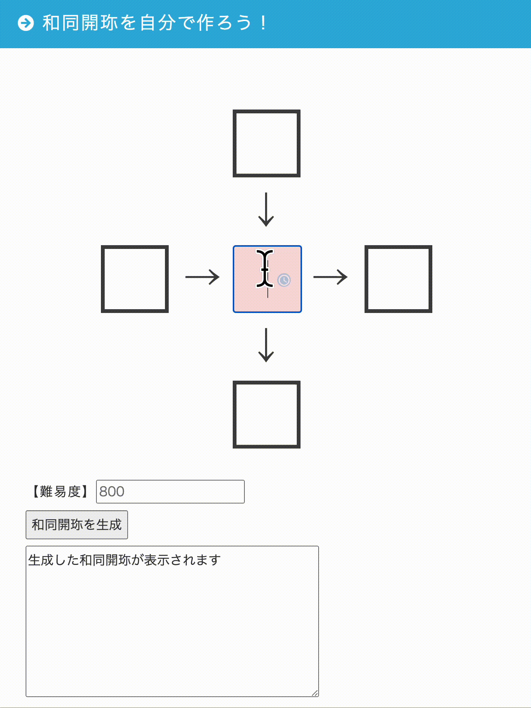

# demo



[熟語パズル（和同開珎）を1クリックで作れるアプリ - なぞまっぷ | 日本最大のリアル脱出ゲーム,謎解き情報サイト](https://www.nazomap.com/entry/20161221_wado)


# How to use (for myself)

```
$ virtualenv uploader
$ source  uploader/bin/activate
$ pip install -r requirements.txt
$ pip install lambda-uploader # 最新のリリース版をインストール
$ pip install git+https://github.com/rackerlabs/lambda-uploader # git main branch をインストール
$ lambda-uploader
λ Building Package
λ Uploading Package
λ Fin
```

[AWS Lambda Pythonをlambda-uploaderでデプロイ ｜ Developers.IO](http://dev.classmethod.jp/cloud/deploy-aws-lambda-python-with-lambda-uploader/)
